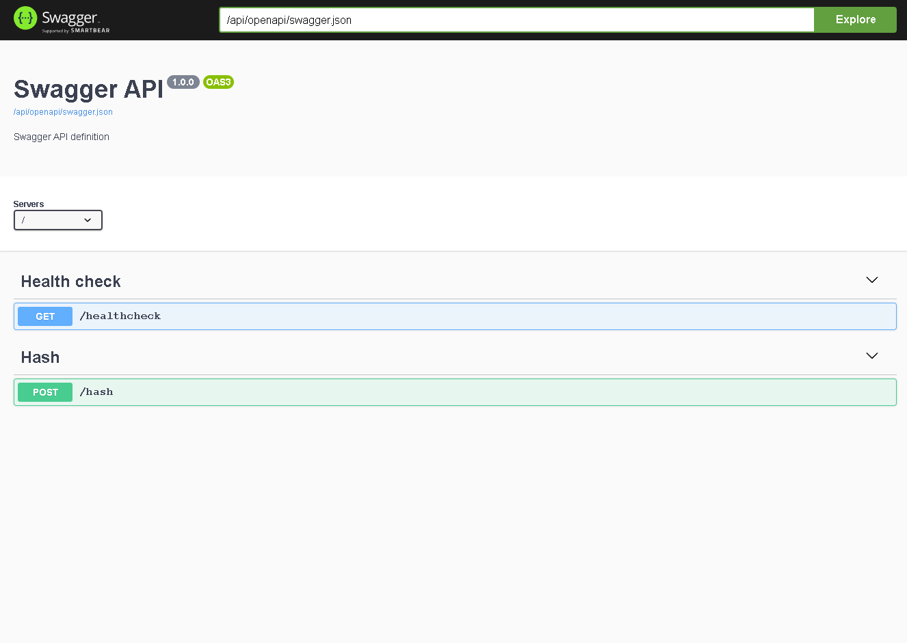

# SimpleAiohttpServer

Приложение для вычисление hash входного текста

# Running The Server

Рабочая директория `..\SimpleAiohttpServer`

Запустить команду после инициализации `.env` по образцу `env.example`

```bash
docker compose up -d --build
```

## Swagger

Url:

```
   http://localhost:8080/api/openapi
```




# Running tests

Рабочая директория `..\SimpleAiohttpServer\hash_app\tests\functional`

Запустить команду после инициализации `.env` по образцу `env.example`

```bash
docker compose up -d --build
```

Создать сервер, используя библиотеку aiohttp, предоставляющий следующие API:
1. Метод: GET, Путь: /healthcheck, Ответ: пустой JSON и статус 200 для каждого запроса.
   Метод: POST, Путь: /hash, Тело запроса: JSON объект с обязательным полем 'string'. Ответ: Если поле отсутствует - статус 400 и JSON с полем 'validation_errors'. В противном случае возвращается JSON с полем 'hash_string', содержащим хэш строки, вычисленный по алгоритму SHA256.
2. Используя библиотеку Click, создать точку входа для запуска сервера.
3. Написать Dockerfile, где команда RUN запускает сервер.
4. Написать тесты с использованием pytest для базовых сценариев вызова API, описанных выше.